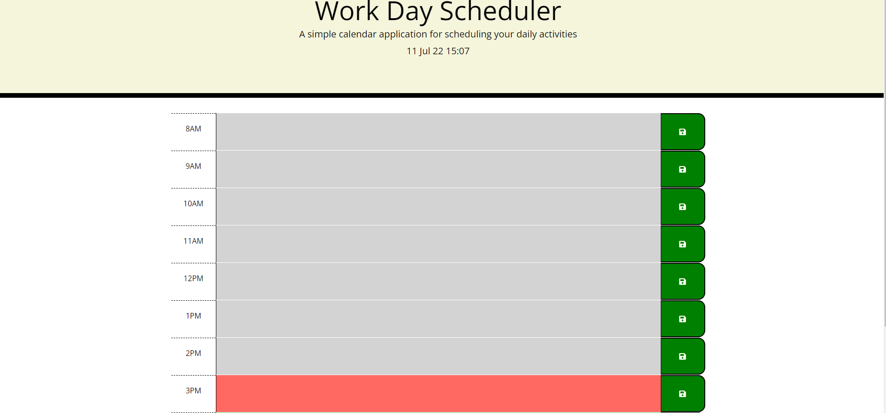
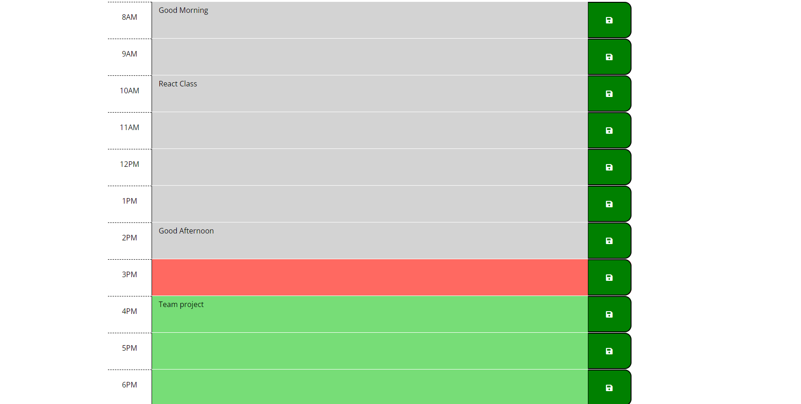
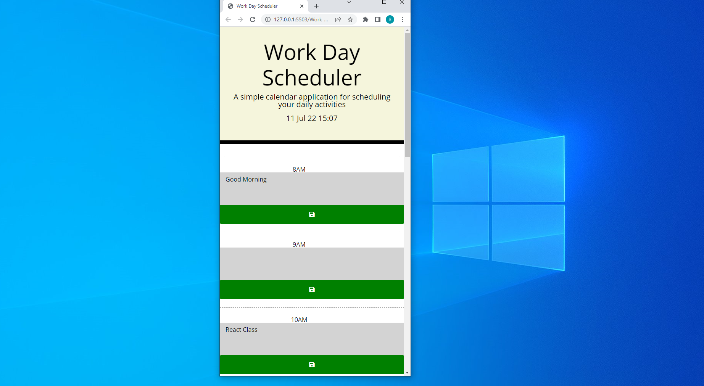

## Work-Day-Scheduler
I would like to develop a work-day scheduler where a user can take a note of his daily activies and he can retrive them before  or after the time block

## Decsription of the project
A simple calendar application that allows a user to save events for each hour of the day. It runs in the browser and feature dynamically updated HTML and CSS powered by jQuery. My Time-Blocks are from 8 AM -6 PM.

#Deployment
[Github repo]:sudheer313/Work-Day-Scheduler  
[Github URL here](https://github.com/sudheer313/Work-Day-Scheduler) 
[Live webpage URL](https://sudheer313.github.io/Work-Day-Scheduler/) 

## User Story

AS AN employee with a busy schedule
I WANT to add important events to a daily planner
SO THAT I can manage my time effectively

## Acceptance Criteria

GIVEN I am using a daily planner to create a schedule
WHEN I open the planner
THEN the current day is displayed at the top of the calendar
WHEN I scroll down
THEN I am presented with time blocks for standard business hours
WHEN I view the time blocks for that day
THEN each time block is color-coded to indicate whether it is in the past, present, or future
WHEN I click into a time block
THEN I can enter an event
WHEN I click the save button for that time block
THEN the text for that event is saved in local storage
WHEN I refresh the page
THEN the saved events persist

### Header displays the current day, date and time
*demo of landing page

### Color-coded each time-block (PAST - Silver, PRESENT - RED, FUTURE - GREEN)

### made my application resposive by adding @media screen and (max-width: 768px), screen and (max-width: 575px)

## Built with

- HTMLs
- CSS
- Jquery
- Bootstrap. 

## Features
It lets user to save and retrive information. And the time blocks are color coded which makes my application user-freindly.

## Credits
1. [MDN files] https://developer.mozilla.org/en-US/docs/Web/API
2. Ask BCS 
3. referred  ashachakre0906/Work-Day-Planner repository
4. referred mevaldovi/Weather-Search-API_revised
repository
5. [Bootstrapdocs]https://getbootstrap.com/docs/5.2/getting-started/introduction/
6. [momentJSDOCS]https://momentjs.com/docs/
7. [Jquery docs] https://api.jquery.com/

## What we learned
I learned few important stuff regarding Jqury and Bootstrap. I also got hands on practice with local storage and Transversing Dom using Jquery.
I became more familiar with Bootstrap and Mooment JS most importantly. This assignmnet help me to get experiance with Bootstrap, Jquary and Moment JS.

## Challenges
I had no clue how to create time and display time. But when I referred to class tutorials and Bootsrap docs helped me through. I also regerred moment Js docs to over come this. Most importantly I was struck at DOM traversal and Jquery documentation helped me to get through. I had some issues understanding local storge and MDN Docs helped me to over come this. 
## Author

@Sudheer kandula
